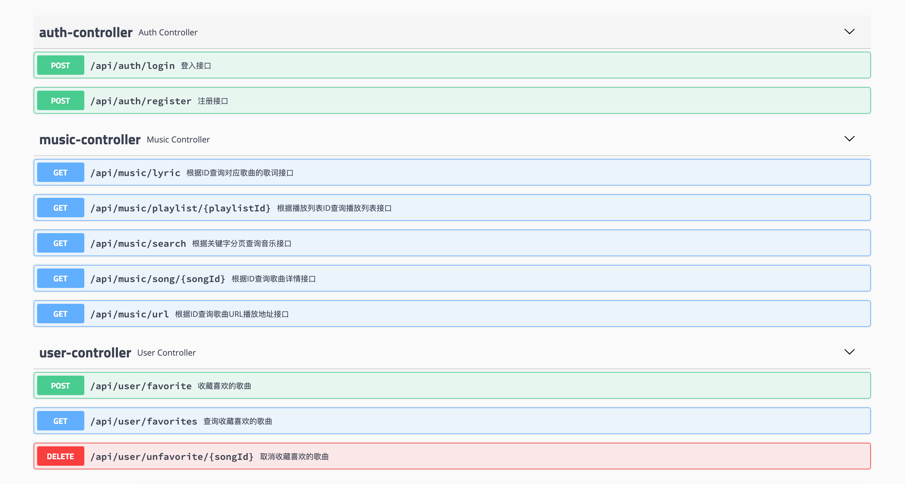

<h1 align="center">Invalid Music</h1>

> :cake: 一个强大的音乐API合集

## 介绍

Invalid Music: 音乐API合集Java版，感谢 <a href="https://github.com/metowolf/Meting" target="_blank">Meting</a>和<a href="https://github.com/moeshin/ncmapi" target="_blank">ncmapi</a>.   

一个强大的音乐API框架促进你的开发
 + **优雅** - 简单易用, 对于所有平台均可一个标准格式.
 + **丰富** - 支持多个音乐平台, 包括 腾讯QQ音乐, 网易云音乐, 虾米音乐, 酷狗, 百度等.
 
## 进度

- [x] 网易云音乐 支持
- [x] 腾讯QQ音乐 支持
- [x] 酷狗音乐 支持
- [x] 虾米, 百度音乐 待开发 

## 依赖

JDK 11+

## 快速开始

```csharp
git clone https://github.com/charles-wxg/invalid-music.git
```

## API列表

<p align="center">

</p>

## 环境

- 运行环境: JDK 11+    
- 开发环境: Intellij IDEA 2019

## 相关项目

- [Meting](https://github.com/metowolf/Meting)
- [ncmapi](https://github.com/moeshin/ncmapi)
 
## 鸣谢

- 本项目参考 <a href="https://github.com/metowolf/Meting" target="_blank">Meting</a> 而来，感谢原作者 metowolf 的贡献
- 网易云音乐API加密模块参考自 <a href="https://github.com/moeshin/ncmapi" target="_blank">ncmapi</a>，感谢作者 moeshin 的贡献

